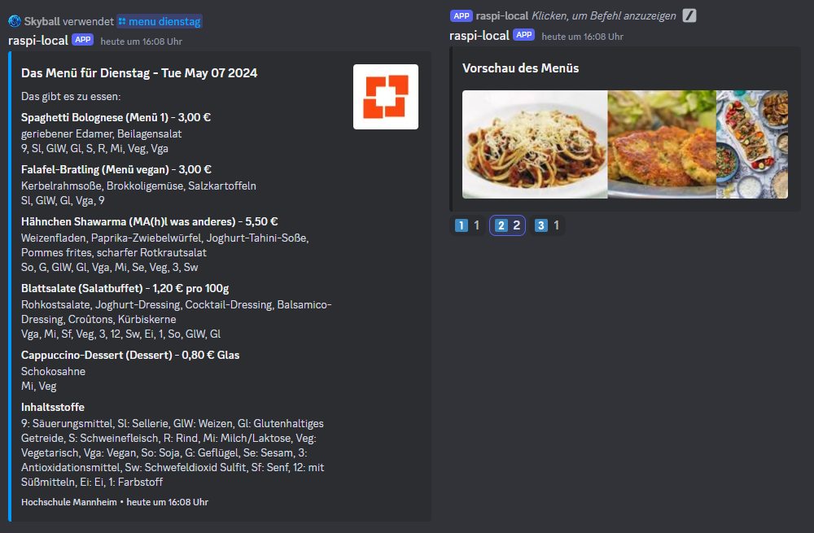

# Bite Board-Bot

> [!TIP]
> This project is a Java reimplementation of the
> [Bite Board Bot in TypeScript](https://github.com/YanWittmann/bite-board-bot), since the TypeScript version faced
> installation issues on Raspberry Pi devices.

A Discord bot that allows for creating custom Menu Providers that can then fetch the menu for a specific day from a
specific canteen or other food location.



<!-- TOC -->
* [Bite Board-Bot](#bite-board-bot)
  * [Installation](#installation)
  * [Setup](#setup)
    * [Configuration](#configuration)
      * [token / clientId](#token--clientid)
      * [dataStoragePath](#datastoragepath)
      * [mensaMenuImagePreviewService](#mensamenuimagepreviewservice)
      * [googleImageApiKey / googleImageApiApplicationId](#googleimageapikey--googleimageapiapplicationid)
      * [language](#language)
    * [Inviting the bot to your server](#inviting-the-bot-to-your-server)
  * [Usage](#usage)
    * [Commands: Fetching the menu](#commands-fetching-the-menu)
    * [Commands: Providers](#commands-providers)
    * [Commands: Scheduled Fetching](#commands-scheduled-fetching)
  * [Creating a Menu Provider](#creating-a-menu-provider)
  * [Raspberry Pi setup](#raspberry-pi-setup)
<!-- TOC -->

## Installation

Before being able to run the bot for the first time (`java -jar ...`), you need to configure the bot.
See the [Configuration](#configuration) section for more information.

```batch
git clone https://github.com/YanWittmann/bite-board-bot-java
cd bite-board-bot-java
mvn clean package
java -jar target/bite-board-bot.jar
```

## Setup

### Configuration

For this, copy the
[bite-board-config-template.json](src/main/resources/bot/bite-board-bot-template.properties)
file into a new file called
[bite-board-config.json](src/main/resources/bot/bite-board-bot.properties)
and configure the values inside according to the following instructions.

If you need to change the path to the configuration file to somewhere outside the jar file, you can do so by setting a
`BITE_BOARD_CONFIG_PATH` environment variable in your process.

Make sure to rerun `mvn clean package` after changing the configuration file.

#### token / clientId

The token is the bot token you get from the [Discord Developer Portal](https://discord.com/developers/applications).
For this, you will need to create a new application and a bot user for it.
There are plenty of tutorials on how to do this on the internet already.

- The `discordBotToken` is the token of the bot, which you can find under the **Bot** tab of your bot in the portal.

Unused:

- The `discordClientId` is the client ID of the bot, which you can find under the **OAuth2** tab of your bot in the
  portal.

#### dataStoragePath

Is a path to a JSON file that will contain data the bot needs to store, such as user settings and periodic tasks.
This file will be created if it does not exist yet.
The default is a file `bot-data.json` in the current working directory.

#### mensaMenuImagePreviewService

This can be either `none`, `googleApi` or `googleImages`.
Depending on the value, the bot will use a different service to fetch images for the menu embeds or not fetch any images
at all.

- `none`: No images will be fetched.
- `googleApi`: The Google Image API will be used to fetch images, see parameters below. Up to 100 images can be fetched
  per day for free, after that you will need to pay for the service.
- `googleImages`: Google Images will be used to fetch images. This is free and the image quality is better than the API
  (in my opinion), although the resolution is (much) lower.

#### googleImageApiKey / googleImageApiApplicationId

The Google Image API key and application ID are used to fetch images for the menu embeds.
You can get them from the [Google Cloud Console](https://console.cloud.google.com/).
Configure `googleApi` for `mensaMenuImagePreviewService` to use the Google Image API.

> Honestly, this is not worth it. The images from the API are just so much worse that the ones from the Google Images
> search. I recommend just using the Google Images search.

#### language

The language the bot should use for the menu embeds. Currently, `en` and `de` are supported.
If you need to add your own language, you can do so by adding a new JSON file to the
[lang](src/main/resources/bot/lang)
directory and putting its name in the [LanguageManager.java](src/main/java/menu/service/LanguageManager.java) file at
the top into the list.

### Inviting the bot to your server

To invite the bot to your server, you need to create an invitation link.
You can do that on the **OAuth2** tab of your bot in the
[Discord Developer Portal](https://discord.com/developers/applications) as well.
Make sure to allow the following permissions (at least):


## Usage

This bot can fetch menus in two modes: triggered by a user command and scheduled periodic fetching.

### Commands: Fetching the menu

The bot provides a `/menu` command that allows users to retrieve the menu for specific days or meals from supported menu
providers.
Use it, followed by a subcommand specifying the date for which you want to see the menu.
Depending on your language, you may use your appropriate subcommands.

```
/menu today     | /menu heute
/menu tomorrow  | /menu morgen
/menu monday    | /menu montag
/menu tuesday   | /menu dienstag
/menu wednesday | /menu mittwoch
/menu thursday  | /menu donnerstag
/menu friday    | /menu freitag
```

If configured, the bot will fetch images for relevant menu items and display them alongside the menu.

### Commands: Providers

You may want to specify your preferred provider for the menu by using the `/menu provider` command with a `provider`
parameter.

To view all available providers, use the `/menu listproviders` command.

### Commands: Scheduled Fetching

In addition to user-triggered commands, the bot also supports scheduled periodic fetching of menus from configured
providers.
This feature allows the bot to automatically post menu information at regular intervals, removing the need to manually
request it each day.

To create a scheduled fetch, your user needs to have the `periodic` role.
For security reasons, roles can only be changed by editing the `bot-data.json` file directly.
In the `users` object, add a new key with your Discord tag (not `id#number` format or the `userId`) and set the
`roles` array to include `periodic`.
You can easily create such an entry by executing the `/menu provider` command once on your user.

Then, run the following command in the Discord channel where you want the menu to be posted.
Note that the `time` parameter is in UTC, meaning you will have to calculate based on your timezone.
You can also use the `/menu time` command to get the current UTC time as reference.
In order to be able to post the menu for the next day(s), you can set an `add` time in minutes that will add the given
amount of minutes to the current time before determining the day for which to fetch the menu.

```
/menu schedule time:18:00:00 provider:Hochschule Mannheim add:1440
```

Your JSON bot data could look like this afterward:

```json
{
  "sendDailyMenuInfo": [{
    "addTime": 1440,
    "provider": "Hochschule Mannheim",
    "time": "18:00:00",
    "channelId": "some-channel-id"
  }],
  "users": [{
    "preferredMenuProvider": "Hochschule Mannheim",
    "roles": ["periodic"],
    "userId": "some-user-id"
  }]
}
```

## Creating a Menu Provider

To create a new menu provider, you need to create a new class that extends the
[MenuItemsProvider](src/main/java/menu/providers/MenuItemsProvider.java)
class.
See the
[HochschuleMannheimTagessichtMenuProvider](src/main/java/menu/providers/implementations/HochschuleMannheimTagessichtMenuProvider.java)
for an example.

After finishing it, you need to register your provider in the
[BiteBoardBotEntrypoint](src/main/java/menu/bot/BiteBoardBotEntrypoint.java)
file by passing an instance into
the [BiteBoardBot](src/main/java/menu/bot/BiteBoardBot.java) constructor.

## Raspberry Pi setup

Any java version >= 8 will work, this for example installed java 17:

```shell
sudo apt update
sudo apt upgrade
sudo apt install default-jdk
java -version
```

Copy via ssh the jar file to the Raspberry Pi after building it:

```shell
C:\Users\user>scp "I:\projects\bite-board-bot-java\target\bite-board-bot.jar" user@192.168.1.114:/home/user/workspace/bite-board-bot/
user@192.168.1.114's password:
bite-board-bot.jar                                                                    100%   66KB   1.7MB/s   00:00
```

Start the bot with to be able to access it later again:

```shell
screen -S bite-board-bot -d -m java -jar bite-board-bot.jar
screen -r bite-board-bot
```

[To detach a screen session](https://askubuntu.com/a/124903): Ctrl+a followed by d. Note the lower case.
